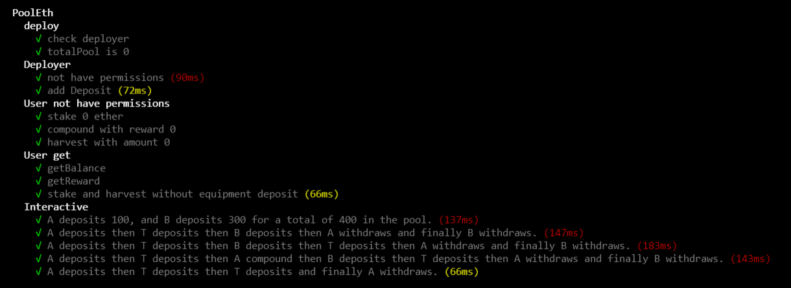

## ETHPool

#### Sumary
ETHPool provides a service where people can deposit ETH and they will receive weekly rewards. Users must be able to take out their deposits along with their portion of rewards at any time. New rewards are deposited manually into the pool by the ETHPool team each week using a contract function.

#### Contract

* **Stake**
    * The team cannot stake.
    * The amount to stake must be greater than 0.

* **Compound**
    *If you have rewards, it is added to the current Staked balance.

* **Deposit**
    * Only the team can deposit.
    * The amount to be deposited must be greater than 0.
    * If there is not stakers can not deposit.
    * The rewards are distributed at this time and the current pool is closed.
    * There are no deposit limits.

* **Harvest**
    * If the staker has balance or rewards or both, he can withdraw.
    * When withdrawing, the balance is empty and rewards are assigned a check mark that they have already withdrawn.

* **Clarifications:**

    Rewards are distributed to bettors once the team deposits. 
    Once the deposit is made, the balances that are in the previous pool are automatically transferred to the next current pool.
    When distributing the rewards it is not entirely accurate.
    A staker can bet as many times as he wants.

#### Contract deployment
 * **ETHPool**
    * Newtwork: Ropsten 
    * Contract address : 0x12B930c1F8e023Bc9D2DB1757Cc55ED7E73FB598 

#### Testing

